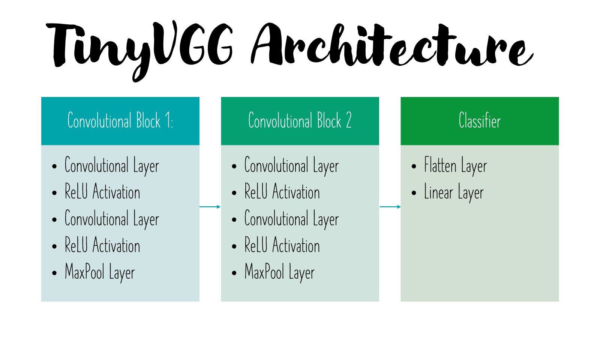
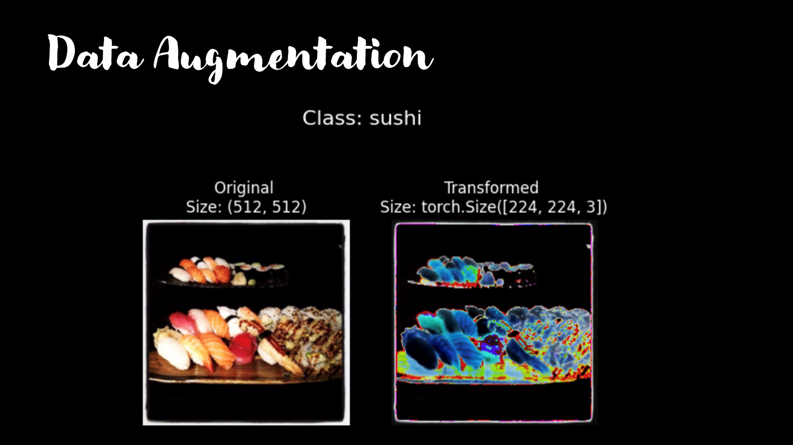
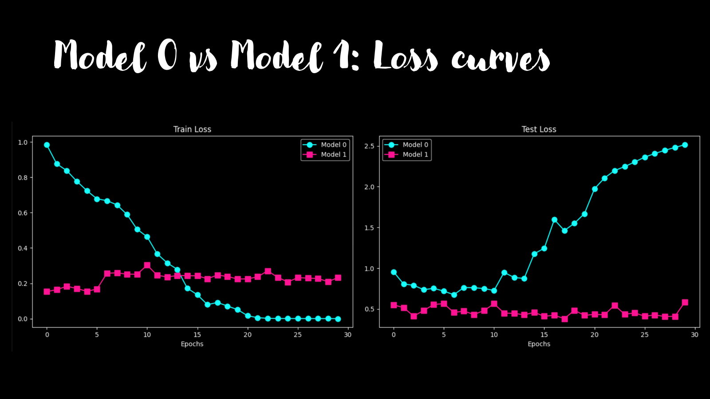
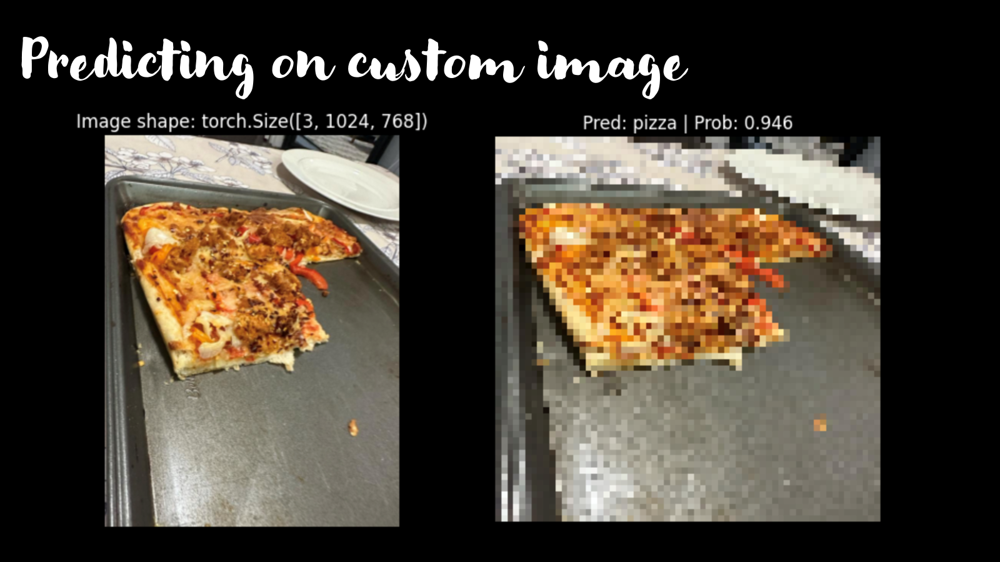

# Food Vision Project

## Overview
This project implements a Convolutional Neural Network (CNN) for food image classification. It specifically focuses on classifying images of pizza, steak, and sushi using PyTorch.

## Features
- Uses TinyVGG architecture for image classification
- Implements data augmentation techniques
- Compares model performance with and without data augmentation
- Includes custom image prediction functionality

## Model Architecture

The project uses the TinyVGG architecture, as illustrated below:



## Data Augmentation

I use data augmentation techniques to improve model performance. Here's an example of how data augmentation affects my training images:



## Model Comparison

I compare the performance of two models: one without data augmentation (Model 0) and one with data augmentation (Model 1). Here are the loss curves for both models:



## Custom Image Prediction

The project includes functionality to make predictions on custom images. Here's an example of a custom image classification:



## Getting Started

### Installation
1. Clone the repository:
   ```
   git clone https://github.com/AllaBlue/Food-Vision.git
   ```
2. Install the required packages:
   ```
   pip install -r requirements.txt
   ```

### Usage
1. Open the `food_vision.ipynb` notebook in a Jupyter environment.
2. Run the cells to train the models and visualize the results.
3. Use the custom prediction function to classify new food images.

## Models
1. Model 0: TinyVGG without data augmentation
2. Model 1: TinyVGG with data augmentation (using TrivialAugmentWide)

## Results
The notebook includes visualizations of training and testing loss/accuracy for both models, allowing for easy comparison of their performance.

## Custom Predictions
The project includes functionality to make predictions on custom images. Use the `pred_and_plot_image` function to classify your own food images.

## Full Presentation
For a comprehensive overview of this project, including more detailed explanations and additional visualizations, please see [full PowerPoint presentation](./Food-Vision-Presentation.pptx).

## Contributing
Contributions to improve the project are welcome. Please feel free to submit a Pull Request.

## Acknowledgments
- This project uses a subset of the Food101 dataset.
- The TinyVGG architecture is inspired by [CNN Explainer](https://poloclub.github.io/cnn-explainer/).